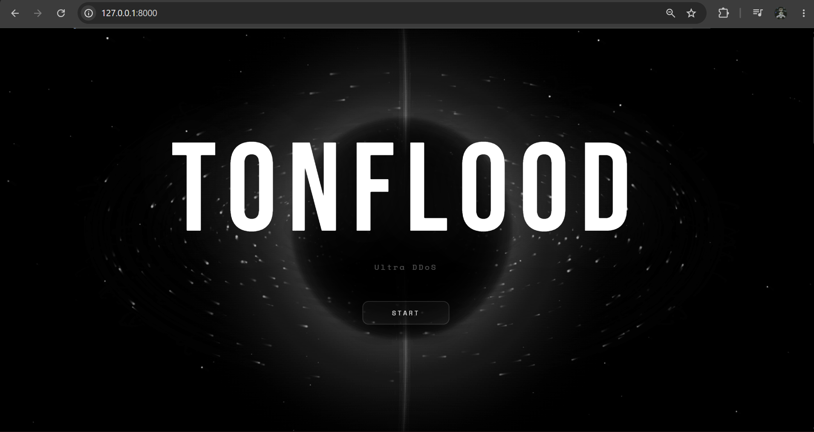

[](https://git.io/typing-svg)

# TonFlood

Async HTTP flood simulator and stress testing tool built with Django, aiohttp, and JavaScript. Web-based UI with real‑time log, RPS counter, and fake IP per request.

For educational purposes and authorized testing only. Author not responsible for misuse.

## Installation & Run

1. Download the project and open the folder in terminal.
2. Install dependencies (Django latest 5.0.x version):

```bash
pip install -r requirements.txt
```

3. Start the server:

```bash
python manage.py runserver
```

4. Open `http://127.0.0.1:8000` in your browser.

## requirements.txt

```text
django~=5.0.0
aiohttp
requests
```
## Preview

<p align="center">
  
</p>

**TonFlood** - Educational project
